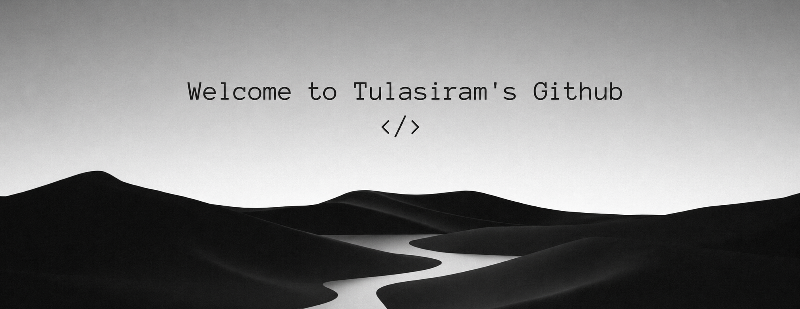

  
  
  
  
  

 

<h2 align="center">  <em>About  me </em></h2>

<table width="100%">
  <tr>
    <td width="60%" valign="middle">
      

        Hello There! <em><b> I'm Tulasiram V </b></em>, a Computer Science & Engineering student and Full-Stack Developer. I enjoy exploring AI, multi-agent systems, and embedded tech to build real-world innovative solutions. Now I'm focused on turning complex problems into elegant, high-performance applications with TypeScript, React, Next.js, Node.js, and Python.
      

    </td>
    <td width="40%" align="center" valign="middle">
      
    </td>
  </tr>
</table>

 

      <em><b> Computer Science & Engineering Student </b></em>  
      <em><b> Full-Stack & Creative Developer </b></em> 
      <em><b> Exploring AI, Multi-Agent Systems & Embedded Tech </b></em> 
      <em><b> Based in Tiruppur, Tamil Nadu </b></em> 

 
 
<h2 align="center">  <em> Technologies & Tools </em> </h2>

  <b>💻 Languages</b> 
  
  
  
  
  

 

  <b>🌐 Frontend</b> 
  
  
  
  
  

 

  <b>⚙️ Backend & APIs</b> 
  
  
  
  
  
  
  

 

  <b>🗄️ Databases</b> 
  
  
  
  

 

  <b>🤖 AI, Data Science & LLMs</b> 
  
  
  
  
  
  
  
  
  
  
  

 

  <b>☁️ DevOps & Cloud</b> 
  
  
  
  
  
  
  

 

  <b>🧪 Testing & Monitoring</b> 
  
  
  
  

 

<h2 align="center">  <em> Statistics </em> </h2>

 

